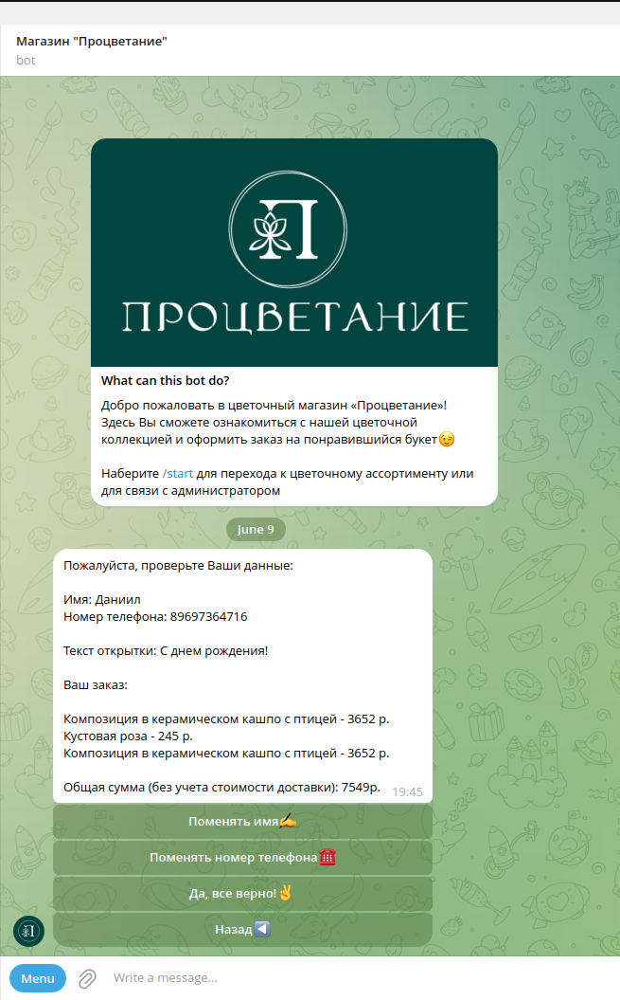

## About:
This project was developed for the flower shop “Prosperity” and consists of two components:
1) A database site in which you can perform standard CRUD operations with products, as well as store photos of products both locally and remotely in Minio.
2) Telegram bot for interacting with customers, where the user can view and order products, as well as ask the administration for help.

The store administration has the ability to add, edit, delete and view products, as well as upload, change or use default photos for each product, which are subsequently saved and transferred to the bot.
Telegram bot users, in turn, see all products with photos, prices, quantities and have the opportunity to interact with the administration in a telegram and place orders. After placing an order, the administration receives information about the contents of the order and contact information for communicating with the client

## Start:
```sh 
docker-compose up -d
```
## Technologies used:

1. Frontend development:

- HTML
- Bootstrap
- Thymeleaf

2. Backend development

- Java (JDK 17)
- Spring Boot, Spring Boot JPA
- Liquebase
- PostgreSQL
- Minio
- Docker
- Reg.ru

## Project demonstration:
Telegram-bot:



 
Web:


